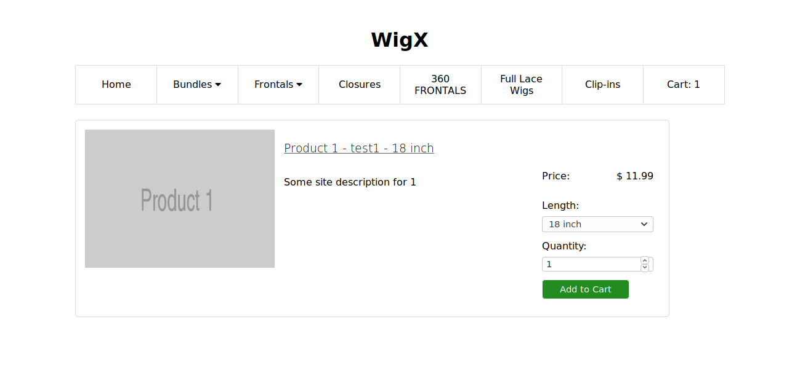

# ShoppingCart
Node/expressjs backend with react frontend. The sites checkout is fully integerated with paypal payments.  Only the webhook listener needs to be done for updating the db after purchase.

## Usage
### Install
1) Configure and install mysql (This step will create your mysql user)

```sh-session
root@server:~$ sudo apt install mysql-server
root@server:~$ mysql_secure_installation
```
2) Import Mysql database schema (Replace username with database user: for security purposes avoid using root)

```bash
root@server:~$ mysql -u <user-name> -p 
Enter password:
Welcome to MySQL monitor....
mysql> CREATE DATABASE <database-name>;
mysql> copy & past the schema.sql file here
```
> Note: If you already have the database created use `mysql -u root -p <db-name> < server/models/schema.sql`

3) Install all the dependencies
```
root@server:~$ cd client && npm install
root@server:~$ cd server && npm install
```
4) Edit the `server/models/connection_template.js` file and update the host/port/user/password & change its name.
```
root@server:~$ vi server/models/connection_template.js
root@server:~$ mv server/models/connection_template.js server/model/connection.js
```
### run
```
root@server:~$ cd client && npm start
root@server:~$ cd server && node app
```
## Server
  1) Routes: Folder contains all the app routes.
  2) Middlewares: Folder contains all logic for handling various requests on the routes
  3) Models: Folder contains all of the sql queries

## Client
  The client was stitched together for display purposes. Has a lot of refactoring and reorganization that needs to be done. All the react components are found in src/.  The structure here is very messy.
 
## Screen Shots





